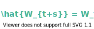
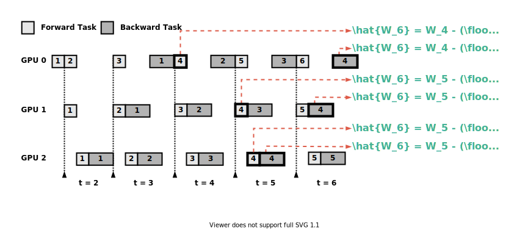
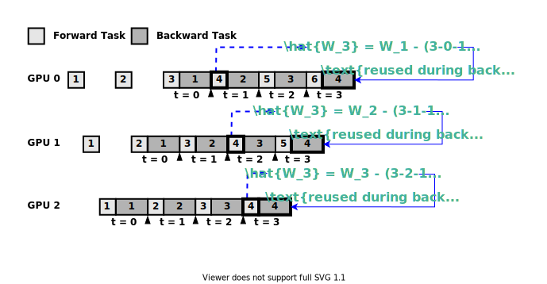

# SpecTrain-PyTorch
A PyTorch implementation of SpecTrain

## Introduction
This is the official implementation of [Efficient and Robust Parallel DNN Training through Model Parallelism on Multi-GPU Platform](https://arxiv.org/abs/1809.02839) (SpecTrain).

In the original paper, **SpecTrain** is implemented with Tensorflow. This repository provides a PyTorch implementation (based on the [source code of pipedream](https://github.com/msr-fiddle/pipedream)).


We provide two versions of **SpecTrain**: 

**Version 1** (paper version): \
This is the weight prediction mechanism introduced in the original paper. We use predicted weights to perform forward and backward passes. Note that the weights we use for forward and backward are not the same. The prediction formulas for forward and backward passes are as follows: 
<div align="center">

</div>
<div align="center">

</div>
The wieghts used by the 4th minibatch in a 3 GPU system are shown below:
<div align="center">

</div>


**Version 2**: \
This version guarantees that the weights used during forward and backward passes are exactly the same.  We use predicted weights to perform forward pass and reuse the predicted weights during backward pass. Note that the "weight version" definition of this version is different from the definition in version 1. The prediction formula is as follow (The notations are the same as Version 1):
<div align="center">

</div>
The wieghts used by the 4th minibatch in a 3 GPU system are shown below:
<div align="center">

</div>

## Environmental Setup
```bash
docker pull nvcr.io/nvidia/pytorch:19.08-py3
```
```bash
nvidia-docker run -it -v /mnt:/mnt --ipc=host --net=host --name <CONTAINER_NAME>
```
You have to install `keras` and `tensorboardX` by yourself after the container is built.
## Quick Start
For those parameters that we did not use in the script, we do not guarantee their functionality.
#### Image Classification
* Dataset: Cifar10
* Models: VGG16, ResNet50, Densenet121, GoogLeNet
```bash
cd src/image_classification/
bash scripts/<model>/<method>_<num_GPUs>.sh
```
`<model>`: [`vgg` | `resnet` | `densenet` | `googlenet`] \
`<method>`: [`vanilla` | `pipedream` | `spectrain_v1` | `spectrain_v2`] \
`<num_GPUs>`: [`2` | `4`]
#### Sentiment Analysis
* Dataset: Imdb
* Models: Transformer, Residual LSTM
```bash
cd src/sentiment_analysis/
bash scripts/<model>/<method>_<num_GPUs>.sh
```
`<model>`: [`transformer` | `lstm` ] \
`<method>`: [`vanilla` | `pipedream` | `spectrain_v1` | `spectrain_v2`] \
`<num_GPUs>`: [`2` | `4`]

## Experiments

* **DP**: data parallelism (2GPU)
* **MP2**: vanilla model parallelism (2GPU)
* **PD2**: pipedream (2GPU)
* **STv1_2**: SpecTrain v1 (2GPU)
* **STv2_2**: SpecTrain v2 (2GPU)
* **MP4**: vanilla model parallelism (4GPU)
* **PD4**: pipedream (4GPU)
* **STv1_4**: SpecTrain v1 (4GPU)
* **STv2_4**: SpecTrain v2 (4GPU)

Model         | DP     | MP2    | PD2    | STv1_2 | STv2_2 | MP4    | PD4    | STv1_4 | STv2_4
--------------|--------|--------|--------|--------|--------|--------|--------|--------|------
VGG           | 91.10% | 90.81% | 90.86% | 91.05% | 91.02% | 88.31% | 88.91% | 88.11% | 89.38%
Resnet        | 90.08% | 88.46% | 89.42% | 89.50% | 89.40% | 88.41% | 89.22% | 89.15% | 89.14%
DenseNet      | 95.54% | 95.34% | 95.48% | 95.42% | 95.34% | 95.54% | 95.45% | 94.81% | 95.45%
GoogLeNet     | 95.06% | 94.48% | 94.71% | 94.41% | 94.45% | 94.23% | 94.52% | 94.45% | 94.54%
Transformer   | 81.12% | 80.35% | 80.35% | 81.27% | 80.02% | 77.26% | 78.11% | 79.71% | 78.79%
LSTM          | 81.74% | 79.03% | 80.02% | 81.56% | 81.10% | 78.11% | 78.24% | 81.24% | 79.48%

## Acknowledgment
This work is partially supported by the generous donation of Facebook. 
## License
Copyright (c) Chi-Chung Chen, Chia-Lin Yang, Hsiang-Yun Cheng, I-Ching Tseng. All rights reserved.


Licensed under the [MIT](LICENSE.txt) license.